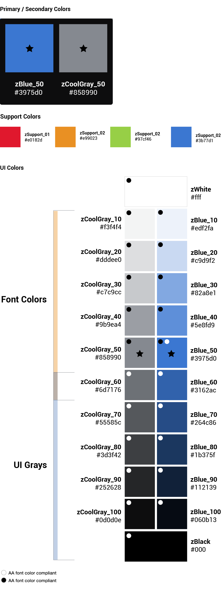
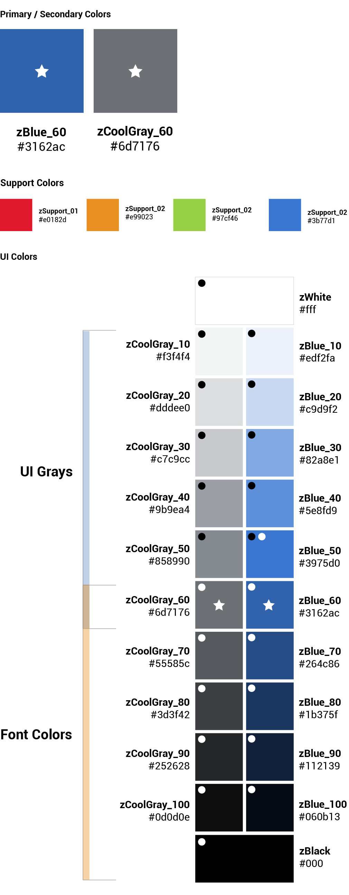

This style guide is the visual language that represents Zowe. It is a living document that will be updated based on the needs of our users and software requirements.

# Principles

* Clear - Our users rely on our software to help them be efficient in their work. The interfaces and experiences we design should be clear so there is never any confusion about where users should click or how to take the next step. Users should always feel confident in their actions.
* Consistent - Users should be able to look at Zowe software products and know they are in a family. Each software product is different but should use similar patterns, icons, and interactions. If a user is switching to a new product within Zowe it should feel familiar.
* Smart - Our users are smart and they need smart software. Zowe design patterns should always compliment the user’s intelligence and reflect the user’s complex work environment. Designs should align with Zowe's Design Language by putting the human needs of the user first.
 
# Color

Color brings a design to life. Color is versatile; it's used to express emotion and tone, as well as place emphasis and create associations. Color should always be used in meaningful and intentional ways in order to create patterns and visual cues.

## Color palette
The Zowe color palette is designed and implemented in a them-able manner. The universal color variables are determined by common roles and usage; it is not based singularly on a color value (i.e. unique hex code). The same color value may be assigned to multiple variables in a theme's palette when the values have distinctly different roles.

A universal variable can also have multiple associated roles when the color is consistently used across those roles. This allows for uniform color application across themes while giving each theme the freedom to express its own individuality at a more detailed level.

## Color contrast | WCAG AA standards

All type color combinations on Zowe must pass WCAG AA standards of 4.5:1 for normal text and 3:1 for large text. For larger text, if the font weight is light (300) or normal (400) the text should be no smaller than 24px. If the font weight is Semi-Bold (600) then the large text should be no smaller than 19px.

Body Text (4.5:1)

Large Text (3:1): at least 24px / 19px semi-bold

WCAG guidelines: https://www.w3.org/WAI/standards-guidelines/wcag/
Contrast Checker Tool: https://webaim.org/resources/contrastchecker/

## Dark Theme Palette

## Light Theme Palette

# Typography

Typography is used to create clear hierarchies, useful organizations, and purposeful alignments that guide users through the product and experience. It is the core structure of any well designed interface.

# Grid

Grid systems are used for creating page layouts through a series of rows and columns that house your content. Zowe uses a responsive, mobile first, fluid grid system that appropriately scales up to 12 columns as the device or view port size increases.

# Icons

Icons are key component for a successful UI design because they are a visual way to help add meaning to elements.
